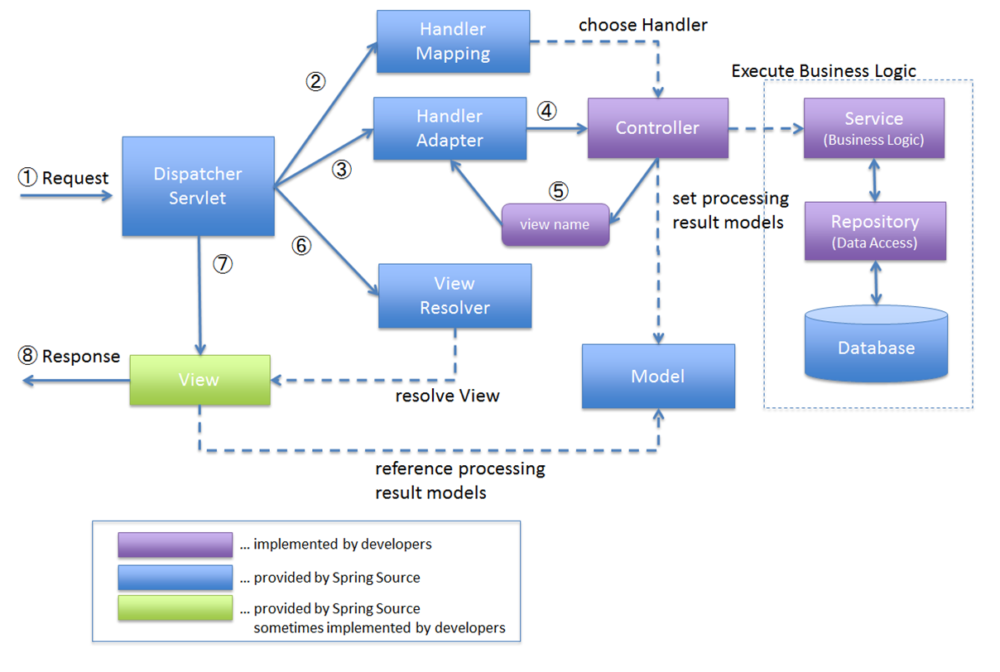

# Web Technologies - Laboratory 03

## Topics

### Spring Boot

#### Spring Boot makes it easy to create stand-alone, production-grade Spring-based applications. By minimizing configuration and setup, it lets developers focus more on application functionality. It automatically configures your application based on the libraries you have on your classpath, making it faster to get a Spring application up and running. Spring Boot’s embedded server capability allows you to avoid complex server configurations.

- **Analogy:** Imagine **Spring Boot** as a modern theater production company. When a playwright (developer) comes with a script (application), the
  company provides a fully-equipped stage (environment) with lighting, sound, and props (embedded servers, configurations, and defaults). This setup
  lets the playwright focus more on the script and actors (application development) rather than the nuances of stage management and technical setup.

1. **@SpringBootApplication:** This is a key annotation in Spring Boot, serving as a launching point for application initialization. `@Configuration`
   tags the class as a source of bean definitions. `@EnableAutoConfiguration` instructs Spring Boot to automatically configure your application
   based on the dependencies you have added. For example, if you have `spring-boot-starter-web` in your classpath, your application will be set up
   as a web application. `@ComponentScan` tells Spring to look for other components, configurations, and services in the current package, allowing
   it to discover and register all your beans.
    - **Analogy:** Imagine it as the theater's artistic director, who oversees the entire play's production, setting up the stage (`@Configuration`),
      automating casting and prop arrangements (`@EnableAutoConfiguration`), and organizing the cast and crew (`@ComponentScan`).

2. **@EnableAutoConfiguration:** This annotation allows Spring Boot to intelligently configure beans and settings based on the application context.
   This process simplifies developer overhead by eliminating the need for specifying certain beans that are commonly required for development.
    - **Analogy:** It's like an intelligent backstage manager who sets up lighting, sound, and scene transitions without needing explicit instructions
      for each play.

3. **@ComponentScan:** Configures the component scanning directives for Spring to find and register your components (like @Controller, @Service,
   @Component, etc.) automatically.
    - **Analogy:** Like a casting agent who scans the theater troupe to find the best actors, technicians, and artists for each role and task.

### Spring MVC

#### Spring MVC (Model-View-Controller) is a module in the Spring Framework for rapidly developing web applications. The MVC pattern separates an application into three main logical components: The Model encapsulates the application data and business logic; The View renders the model data, generating the UI; The Controller processes user inputs, interacts with the model, and selects a view for response. This promotes the organized structuring of code, enabling a clear separation of concerns and easier maintenance.

- **Analogy:** **Spring MVC** can be likened to a theatrical play. In this one-act play, the **Model** is the script and storyline, holding the
  essential data and plot. The **View** is akin to the stage design and lighting, visualizing the story for the audience. The **Controller** is the
  director, taking audience input (user requests), interpreting the script (Model), and deciding how the story should unfold on stage (selecting the
  View). This cohesive production ensures that the play (web application) delivers a seamless and engaging performance.

1. **Model:** The Model in MVC pattern is responsible for managing application data. It updates the view whenever the data changes.
   The model is not aware of the view or the controller, leading to a decoupled and cleaner code structure.
    - **Analogy:** Like the script and backstory of the play, providing depth and information to the performance.

2. **View:** In Spring MVC, the view is responsible for rendering model data, provided by the controller, into a user-readable
   format. Usually, this is in the form of HTML or JSON/XML for web services.
    - **Analogy:** The view is the stage where the story (data) unfolds visually for the audience.

3. **Controller:** The controller handles user requests, processes them (possibly updating the model), and returns a view. It acts as an
   intermediary between the Model and the View.
    - **Analogy:** The director, who interprets audience requests, selects the right script (model), and stages the play (view).

4. **Servlet:** In the context of Spring MVC and Spring Boot, a servlet is a fundamental building block for handling HTTP requests.
   The DispatcherServlet, for example, is a central servlet that dispatches requests to various controllers.
    - **Analogy:** The ushers and stagehands who direct the audience to their seats (requests) and ensure their safe exit (responses).

5. **@Controller, @RequestMapping, @ModelAttribute:** These are integral parts of defining and handling the workflow in a Spring MVC
   application. `@Controller` identifies a class as a controller in the MVC pattern. `@RequestMapping` specifies URL patterns and HTTP methods for
   handler methods. `@ModelAttribute` is used to bind method parameters or return values to a model attribute, making it available for the view.
    - **@Controller - Analogy:** Like a badge or a title that distinguishes the director among the crew, signifying their role in managing the play's
      flow.
    - **@RequestMapping - Analogy:** A program guide, directing audience questions to the appropriate scenes and acts in the play.
    - **@ModelAttribute - Analogy:** The scriptwriter tailoring dialogues based on audience reactions, enhancing the story's presentation on stage.

6. **Bean Scopes (Request, Session, Application):** Each scope dictates how long a bean stays alive and who can access it. For instance, a bean
   defined with a `request` scope lives as long as a single HTTP request. In contrast, a `session` - scoped bean remains available during an HTTP
   session, and
   an `application` - scoped bean is shared across all sessions, living as long as the web application is running.
    - **Request - Analogy:** Props crafted for a single scene.
    - **Session - Analogy:** Costumes worn by an actor for an entire show.
    - **Application - Analogy:** Grand decorations seen by every audience member throughout the theater's season.

### Thymeleaf

#### Thymeleaf is a modern server-side Java template engine for web and standalone environments, capable of processing HTML, XML, JavaScript, CSS, and even plain text. It's particularly suited for serving XHTML/HTML5 in web applications, integrating with Spring frameworks, and works well with HTML5.

- **Analogy:** Think of Thymeleaf as a skilled artist specializing in creating detailed, dynamic paintings (web pages). This artist can work with
  various materials (HTML, XML, JavaScript) and is particularly good at creating lifelike scenes (HTML5 web applications). They're also adept at
  collaborating with a construction team (Spring Framework), ensuring the artwork fits perfectly in the architectural design.

1. **Templates:** Templates in Thymeleaf are essentially the blueprints or pre-designed frameworks for the final output (usually an HTML file). They
   define the static structure of the output along with placeholders for dynamic content.

    - **Analogy:** Templates in Thymeleaf can be likened to a storyboard used in film-making. It provides a skeletal framework outlining each
      scene's layout, where specific dynamic elements, like dialogue or characters (in Thymeleaf, dynamic data), will be inserted. The storyboard
      ensures consistency while allowing dynamic adaptation based on the script.

2. **Expression Language:** Thymeleaf's expression language (Thymeleaf Standard Expression Language - SpEL) is used within templates to bind data from
   the application (typically the model attributes) to the template, enabling dynamic content generation.

    - **Analogy:** Imagine the expression language in Thymeleaf as a script translator on a movie set, where the script is in a foreign language. This
      translator interprets and adapts the script (model data) for the actors (template) in real-time, ensuring the dialogue fits seamlessly into the
      storyboard.

3. **Integration with Spring Framework:** Thymeleaf integrates smoothly with the Spring Framework, allowing for seamless and flexible data binding,
   internationalization, and general Spring application context utilization within templates.

    - **Analogy:** In our movie production analogy, integrating Thymeleaf with Spring Framework is like having a specialized collaboration where the
      artist (Thymeleaf) works directly with the construction team (Spring Framework). This partnership ensures that the artworks (web pages) are not
      only aesthetically pleasing but also functionally integrated with the building's infrastructure (Spring-based web application), providing a
      holistic experience.

4. **Server-Side Rendering:** Server-side rendering in Thymeleaf means that templates are processed on the server to generate and send complete HTML
   to the client's browser, reducing the need for heavy client-side processing.

    - **Analogy:**  Consider server-side rendering as akin to preparing an entire movie for a viewer, rather than having them act it out. The movie (
      complete web page) is fully directed, produced, and ready to watch on the server, and sent to the viewer's screen (browser) fully formed,
      negating the need for the viewer to interpret a script or storyboard (client-side processing) themselves.

### Maven Dependencies

1. **spring-boot-starter-web:** This starter provides all the necessary dependencies to build a web application. This includes packages for RESTful
   application development, Tomcat as the default embedded container, Spring MVC, and other necessary libraries.
    - **Analogy:** This is akin to a pre-assembled play kit, containing scripts, costumes, and set designs, making it easy to start a new production.

2. **spring-boot-starter-thymeleaf:** It's a quick way to get Thymeleaf set up in your Spring Boot application. Thymeleaf is a Java template engine
   for processing and creating HTML, XML, JavaScript, CSS, and text.
    - **Analogy:** Consider this as a specialized set design and decoration kit, focusing on the visual elements of the play that the audience will
      interact with.

### [Exercise 1](Example%2001/README.md)

### [Exercise 2](Example%2003/README.md)