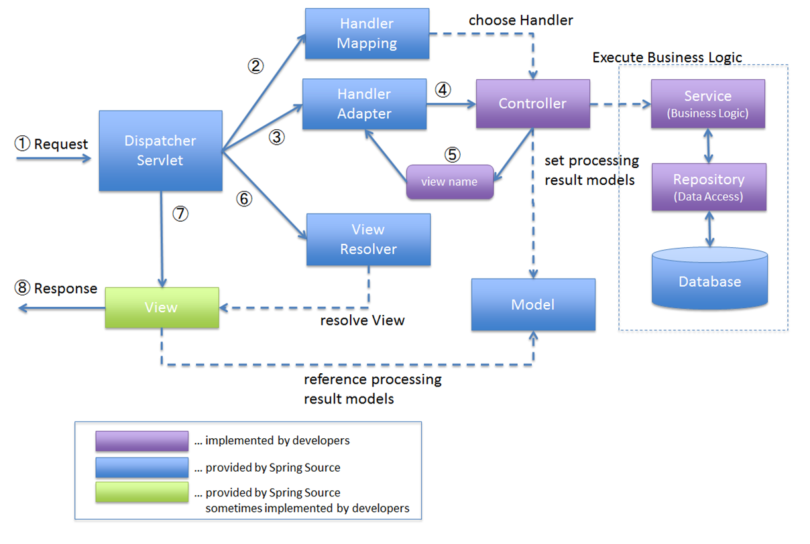

# Web Technologies - Laboratory 06

## Topics

### Spring Boot

#### Spring Boot makes it easy to create stand-alone, production-grade Spring-based applications. By minimizing configuration and setup, it lets developers focus more on application functionality. It automatically configures your application based on the libraries you have on your classpath, making it faster to get a Spring application up and running. Spring Boot’s embedded server capability allows you to avoid complex server configurations.

- **Analogy:** Imagine **Spring Boot** as a modern theater production company. When a playwright (developer) comes with a script (application), the
  company provides a fully-equipped stage (environment) with lighting, sound, and props (embedded servers, configurations, and defaults). This setup
  lets the playwright focus more on the script and actors (application development) rather than the nuances of stage management and technical setup.

1. **@SpringBootApplication:** This is a key annotation in Spring Boot, serving as a launching point for application initialization. `@Configuration`
   tags the class as a source of bean definitions. `@EnableAutoConfiguration` instructs Spring Boot to automatically configure your application
   based on the dependencies you have added. For example, if you have `spring-boot-starter-web` in your classpath, your application will be set up
   as a web application. `@ComponentScan` tells Spring to look for other components, configurations, and services in the current package, allowing
   it to discover and register all your beans.
    - **Analogy:** Imagine it as the theater's artistic director, who oversees the entire play's production, setting up the stage (`@Configuration`),
      automating casting and prop arrangements (`@EnableAutoConfiguration`), and organizing the cast and crew (`@ComponentScan`).

2. **@EnableAutoConfiguration:** This annotation allows Spring Boot to intelligently configure beans and settings based on the application context.
   This process simplifies developer overhead by eliminating the need for specifying certain beans that are commonly required for development.
    - **Analogy:** It's like an intelligent backstage manager who sets up lighting, sound, and scene transitions without needing explicit instructions
      for each play.

3. **@ComponentScan:** Configures the component scanning directives for Spring to find and register your components (like @Controller, @Service,
   @Component, etc.) automatically.
    - **Analogy:** Like a casting agent who scans the theater troupe to find the best actors, technicians, and artists for each role and task.

### Spring MVC

#### Spring MVC (Model-View-Controller) is a module in the Spring Framework for rapidly developing web applications. The MVC pattern separates an application into three main logical components: The Model encapsulates the application data and business logic; The View renders the model data, generating the UI; The Controller processes user inputs, interacts with the model, and selects a view for response. This promotes the organized structuring of code, enabling a clear separation of concerns and easier maintenance.

- **Analogy:** **Spring MVC** can be likened to a theatrical play. In this one-act play, the **Model** is the script and storyline, holding the
  essential data and plot. The **View** is akin to the stage design and lighting, visualizing the story for the audience. The **Controller** is the
  director, taking audience input (user requests), interpreting the script (Model), and deciding how the story should unfold on stage (selecting the
  View). This cohesive production ensures that the play (web application) delivers a seamless and engaging performance.

1. **Model:** The Model in MVC pattern is responsible for managing application data. It updates the view whenever the data changes.
   The model is not aware of the view or the controller, leading to a decoupled and cleaner code structure.
    - **Analogy:** Like the script and backstory of the play, providing depth and information to the performance.

2. **View:** In Spring MVC, the view is responsible for rendering model data, provided by the controller, into a user-readable
   format. Usually, this is in the form of HTML or JSON/XML for web services.
    - **Analogy:** The view is the stage where the story (data) unfolds visually for the audience.

3. **Controller:** The controller handles user requests, processes them (possibly updating the model), and returns a view. It acts as an
   intermediary between the Model and the View.
    - **Analogy:** The director, who interprets audience requests, selects the right script (model), and stages the play (view).

4. **Servlet:** In the context of Spring MVC and Spring Boot, a servlet is a fundamental building block for handling HTTP requests.
   The DispatcherServlet, for example, is a central servlet that dispatches requests to various controllers.
    - **Analogy:** The ushers and stagehands who direct the audience to their seats (requests) and ensure their safe exit (responses).

5. **@Controller, @RequestMapping, @ModelAttribute:** These are integral parts of defining and handling the workflow in a Spring MVC
   application. `@Controller` identifies a class as a controller in the MVC pattern. `@RequestMapping` specifies URL patterns and HTTP methods for
   handler methods. `@ModelAttribute` is used to bind method parameters or return values to a model attribute, making it available for the view.
    - **@Controller - Analogy:** Like a badge or a title that distinguishes the director among the crew, signifying their role in managing the play's
      flow.
    - **@RequestMapping - Analogy:** A program guide, directing audience questions to the appropriate scenes and acts in the play.
    - **@ModelAttribute - Analogy:** The scriptwriter tailoring dialogues based on audience reactions, enhancing the story's presentation on stage.

6. **Bean Scopes (Request, Session, Application):** Each scope dictates how long a bean stays alive and who can access it. For instance, a bean
   defined with a `request` scope lives as long as a single HTTP request. In contrast, a `session` - scoped bean remains available during an HTTP
   session, and
   an `application` - scoped bean is shared across all sessions, living as long as the web application is running.
    - **Request - Analogy:** Props crafted for a single scene.
    - **Session - Analogy:** Costumes worn by an actor for an entire show.
    - **Application - Analogy:** Grand decorations seen by every audience member throughout the theater's season.

### JavaScript Web Application (Client-Side Rendering)

#### Advantages:

- Interactivity: JavaScript allows for creating highly interactive and dynamic user interfaces, such as SPAs. Frameworks like React, Angular, or
  Vue.js enable this with ease.
- User Experience: Client-side rendering can provide a smoother user experience, as pages can update without a full reload.
- Offline Capabilities: JavaScript applications can be designed to work offline more effectively using service workers, local storage, and other
  caching mechanisms.
- Modern Architecture: Adopting JavaScript frameworks can lead to a more modern architecture, separating the frontend from the backend, and making it
  easier to develop, test, and maintain.

#### Disadvantages:

- SEO Challenges: SPAs and client-side rendered applications can face challenges with SEO, as content is not rendered until the JavaScript is executed
  by the browser.
- Initial Load Time: JavaScript heavy applications can suffer from longer initial load times, as the browser needs to download, parse, and execute
  JavaScript before rendering the content.
- Complexity: Building an application with JavaScript frameworks can introduce additional complexity in terms of state management and handling data
  synchronization with the backend.

### Spring Framework Integration

#### Spring Framework, when used as the backend for client-side rendered applications, primarily handles business logic, data access, and service-level operations, while the client-side focuses on the user interface and interactivity. Here's how Spring functionality helps and integrates with client-side rendering:

- **Restful APIs:** Spring's support for building RESTful services is fundamental when working with client-side JavaScript frameworks or libraries. It
  uses @RestController and @RequestMapping annotations to easily create API endpoints that JavaScript code can consume via AJAX or Fetch API calls.
- **Data Access:** Spring provides comprehensive data access support with Spring Data repositories, making it easy to interact with databases. The
  repositories abstract the complexity of raw database access, transactions, and CRUD operations, exposing simple interfaces that can be injected into
  your services.
- **Security:** Spring Security can protect REST endpoints, requiring authentication and authorization before the JavaScript application can access
  them. It provides features like session management, OAuth2, CSRF protection, and CORS policies that are crucial for modern web applications.
- **Validation:** Spring supports validation mechanisms that can be applied to the data models, ensuring the integrity of the data before it's
  processed by the backend or returned to the client-side.
- **Business Logic:** The core of the application logic, such as calculations, rules processing, and decision-making, is handled in the service layer
  of a Spring application, ensuring that the client-side remains lightweight and focused only on presentation logic.
- **Exception Handling:** Spring provides a centralized exception handling mechanism (@ControllerAdvice), which allows for cleaner error handling and
  consistent error responses to the frontend.
- **Testing:** Spring's testing support is comprehensive, with facilities to test the RESTful endpoints, service components, and integration tests
  that can simulate the interactions between the backend and frontend.

### Maven Dependencies

1. **spring-boot-starter-web:** This starter provides all the necessary dependencies to build a web application. This includes packages for RESTful
   application development, Tomcat as the default embedded container, Spring MVC, and other necessary libraries.
    - **Analogy:** This is akin to a pre-assembled play kit, containing scripts, costumes, and set designs, making it easy to start a new production.

### [Exercise 1](Example%2001/README.md)